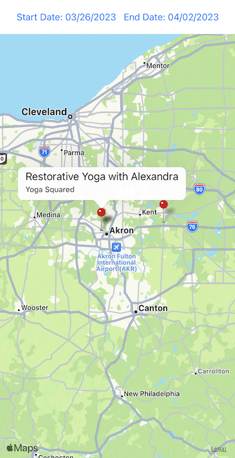

# Calendar Map

This is a simple app that shows a map with the location of the events in your calendar. It was created as a proof of concept, using ChatGPT and a little bit of manual intervention, in just a few hours. Approximately 95% of the code was generated by ChatGPT using the GPT-4 model.

The original prompt used to create the app was:

> Use Expo to build a native app that reads users mobile device calendar, and shows all calendar events on a map based on the location of the event. The UI should have a control for selecting the date range of events.

## How to run

1. Install Expo CLI: `npm install -g expo-cli`
2. Clone this repo: `git clone git@github.com:localjo/CalendarMapApp.git`
3. Install dependencies: `expo install`
4. Create a `.envrc` file with `export GOOGLE_MAPS_API_KEY=<your_api_key_here>`
5. Source the `.envrc` file: `source .envrc`
6. Start Expo development mode: `expo start` and follow the instructions to run the app on your device or simulator.

## Known issues

- The app has only really been tested on iOS since that's all I have access to. It should work on Android, but I haven't tested it. It might need some modifications to the map component, and another Google Maps API key.
- Clicking on event marker doesn't open the event in the Calendar app on iOS. This is a limitation of the `calshow:` URL scheme on iOS, but there should be a workaround.
- Many Calendar events don't have a precise location, so the map may be mostly empty. This is a limitation of the data. This app is using Google's Geocoding API to try to find the location of events that don't have one, but it's not perfect.

## Contributing

This app was created as a proof of concept, and is not intended to be a production app. However, if you'd like to contribute, feel free to open a PR or issue. In keeping with the spirit of this proof of concept, if you open a PR, please use ChatGPT to generate most of the code and explain in the PR description how you used ChatGPT to generate the code.

## License

As part of this code was generated by OpenAI's GPT models, sharing and usage of this code must comply with the [OpenAI Terms of Service](https://openai.com/terms/) and [Sharing & publication policy](https://openai.com/policies/sharing-publication-policy/).

Otherwise, the code in this repository is licensed under the [Attribution-NonCommercial-ShareAlike 3.0 Unported (CC BY-NC-SA 3.0)](https://creativecommons.org/licenses/by-nc-sa/3.0/) license, which means you can use it for non-commercial purposes, as long as you give credit to [Josiah Sprague](https://github.com/localjo) as the original author and share any modifications under the same license.
